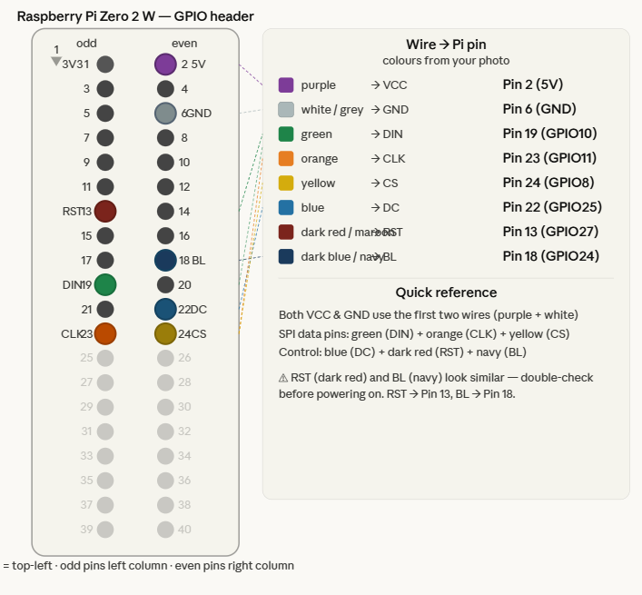

# BambuHelper

> **Python port of [Keralots/BambuHelper](https://github.com/Keralots/BambuHelper) — all credit for the original design, icons, and display logic goes to [@Keralots](https://github.com/Keralots).**

A Python port of [BambuHelper](https://github.com/Keralots/BambuHelper) for the **Raspberry Pi Zero 2 W** with a **Waveshare ST7789 LCD** (240×240 or 320×240). Displays live Bambu Lab 3D printer status — nozzle and bed temperatures, print progress, ETA, layer count, and speed. Also serves a live display preview image via the web portal at `/preview`.


---

## Hardware

| Component | Details |
|-----------|---------|
| Raspberry Pi | Zero 2 W (64-bit, Raspberry Pi OS Bookworm Lite) |
| Display (default) | Waveshare 1.54" LCD Module — 240×240 ST7789 SPI (`waveshare_1in54`) |
| Display (alt) | Waveshare 2.0" LCD Module — 320×240 ST7789 SPI (`waveshare_2in0`) |
| Display (alt) | Waveshare 1.3" LCD Module — 240×240 ST7789 SPI (`waveshare_1in3`) |
| Printer | Any Bambu Lab printer (X1, X1C, X1E, P1P, P1S, A1, A1 Mini) |

---

## Display Wiring (GPIO)

| Display Pin | Pi GPIO | Physical Pin |
|-------------|---------|-------------|
| VCC | 5V | Pin 2 |
| GND | GND | Pin 6 |
| DIN (MOSI) | GPIO 10 | Pin 19 (SPI0 MOSI) |
| CLK (SCLK) | GPIO 11 | Pin 23 (SPI0 CLK) |
| CS | GPIO 8 | Pin 24 (CE0) |
| DC | GPIO 25 | Pin 22 |
| RST | GPIO 27 | Pin 13 |
| BL | GPIO 18 | Pin 12 |

> The wiring is **identical for all three supported display models** — only the `display_model` config value differs.
> **Enable SPI** on the Pi: `sudo raspi-config` → Interface Options → SPI → Enable.
> The installer (`install.sh`) does this automatically.



---

## Quick Install

```bash
# On your Pi Zero 2 W, as root:
curl -fsSL https://raw.githubusercontent.com/OktaneZA/bambuhelper/master/install.sh | sudo bash
```

---

## Configuration

After installation, open the web portal in your browser. The port is randomly
assigned during install from the range 4001–65000 — the exact URL is shown at
the end of the install output:

```
http://<pi-ip>:<port>
```

The installer prompts for a portal password:

- **Leave blank** — portal is accessible from **localhost only** (`127.0.0.1` / `::1`).
  Useful when you access the Pi via SSH tunnel (`ssh -L 8080:localhost:<port> pi@<pi-ip>`).
  All remote access is blocked with HTTP 403.
- **Set a password** — HTTP Basic Auth is required from all clients (username: `admin`).
  The password is stored as a PBKDF2-HMAC-SHA256 hash in the config file; it is never
  stored in plaintext.

To change the password after install, use the web portal form — the new value is
hashed automatically on save.

---

## LAN Mode Setup

LAN mode connects directly to your printer over your local network. No internet required after initial setup.

**What you need:**
1. **Printer IP address** — found in the printer's touchscreen under *Network* settings, or in your router's DHCP list. Tip: assign a static IP to avoid it changing.
2. **Access code** — on the printer touchscreen go to **Settings → LAN Only Mode**, toggle it **on**, and the 8-character access code will be displayed (e.g. `12345678`). You can turn LAN Only Mode back off after noting the code — the access code stays the same.
3. **Serial number** — not shown in the printer's own touchscreen menus. To find it: open **Bambu Studio** on your PC, go to the **Device** tab, select your printer, and click the **firmware/update** button — the serial number (e.g. `01P00C123456789`) is shown in that dialog.

**In the web portal:**
1. Set *Connection Mode* → **LAN**
2. Enter *Printer IP*, *Access Code*, *Serial Number*
3. Click **Save & Reconnect**

**Troubleshooting LAN:**
- Can you ping the printer? `ping <printer-ip>`
- Is the access code correct? It changes if you press "Reset" in the printer's network settings.
- Check logs: `journalctl -u bambu-helper -f`

---

## Cloud Mode Setup

Cloud mode connects via Bambu Lab's MQTT cloud service. Useful if the Pi is on a different network from the printer, or if LAN access is blocked.

**Requirements:**
- A Bambu Lab account
- Your printer registered in Bambu Studio / Bambu Handy
- A **cloud token** (valid for ~3 months, then requires renewal)

### Getting Your Cloud Token

> No credentials are stored — BambuHelper only stores this time-limited JWT access token, valid for ~3 months. It has read-only access and cannot send commands to your printer.

**The installer handles this automatically.** During `install.sh` setup, when you select Cloud mode it calls `scripts/get_cloud_token.py`, which logs in to the Bambu Lab API directly (the same endpoint used by Bambu Studio / OrcaSlicer). Enter your email and password at the prompts. If Bambu sends a verification code to your email, you will be prompted for it in the terminal.

To re-run the token extraction manually (e.g. after the token expires):

```bash
# On the Pi:
sudo /opt/bambu-helper/.venv/bin/python /opt/bambu-helper/scripts/get_cloud_token.py

# Or on any PC with Python:
pip install requests
python scripts/get_cloud_token.py
```

The script handles all Bambu login flows automatically:

| Flow | When it occurs |
|------|---------------|
| Direct login | Normal login — token returned immediately |
| `verifyCode` | New device / unrecognised IP — Bambu emails a code; enter it at the prompt |
| `tfaKey` | Similar email-based TFA flow via the TFA endpoint |
| TOTP (`tfa`/`mfa`) | Authenticator app — enter the 6-digit code at the prompt |

Once you have the token, paste it into the web portal under *Connection → Cloud Token*, or pass it to the script's `--output-file` flag and copy it to the config.

### Configuring Cloud Mode in the Portal

1. Set *Connection Mode* → **Cloud**
2. Enter your **Token** (the long string from `get_cloud_token.py`)
3. Select your **Region**: `us` (Americas/Europe) or `cn` (China)
4. Enter your printer's **Serial Number**
5. Click **Save & Reconnect**

The portal extracts your user ID from the token automatically (JWT decode, no Bambu API call needed).

> **Note:** Bambu tokens vary in format by account type. Microsoft / Hotmail accounts receive tokens starting with `AAAL...` rather than `eyJ...`. All formats are supported.

**Troubleshooting Cloud:**
- Token expired? Re-run `scripts/get_cloud_token.py` and update in the portal.
- Wrong region? EU accounts use the `us` region.
- Check logs: `journalctl -u bambu-helper -f`

---

## Screen States

| State | Shown When | Layout |
|-------|-----------|--------|
| Splash | Boot (2 s) | Logo + printer name |
| Connecting | MQTT not yet connected | Spinner + animated dots + attempt counter |
| Idle | Connected, not printing | Nozzle + bed arc gauges |
| Printing | Print in progress | Top: nozzle + bed arc gauges. Bottom: progress % (left) + ETA (right) |
| Paused | `gcode_state = PAUSE` | Same as printing, ETA panel shows "PAUSED" |
| Finished | Print complete | Expanding ring animation + checkmark + filename |
| Clock | After finish timeout elapses | Large digital clock + date |
| Off | Display off | Blank |

---

## Web Portal

| URL | Description |
|-----|-------------|
| `/` | Configuration form |
| `/status` | Live printer state as JSON |
| `/preview` | Last rendered display frame as a 3× scaled PNG (720×720 for 240×240, 960×720 for 320×240) — useful for verifying the display without physical hardware |
| `/health` | Liveness check (no auth required) |

---

## Updating

```bash
sudo bash /opt/bambu-helper/update.sh
```

---

## Post-Install Validation

```bash
sudo /opt/bambu-helper/.venv/bin/python /opt/bambu-helper/validate.py
```

Expected: 5 checks, all `[ PASS ]`.

---

## Logs

```bash
journalctl -u bambu-helper -f
```

---

## Running Tests (dev)

```bash
pip install -r requirements-dev.txt
pytest --tb=short -q
```

Tests mock all Pi hardware — safe on Windows/macOS/Linux.

---

## Credits & Attribution

This project is a **Python port** of the original **[BambuHelper](https://github.com/Keralots/BambuHelper)** by [@Keralots](https://github.com/Keralots).

The original is an ESP32/Arduino C++ project that inspired this port in its entirety. The following were ported faithfully:

| Original file | Ported to | What it contains |
|---|---|---|
| `display_ui.cpp` | `src/display.py` | All screen states, layout, progress bar |
| `display_gauges.cpp` | `src/display.py` | Arc gauge drawing (240° sweep) |
| `display_anim.cpp` | `src/display.py` | Spinner, dots, completion ring animation |
| `icons.h` | `src/display.py` | All 16×16 and 32×32 bitmap icons |
| `bambu_mqtt.cpp` | `src/bambu.py` | MQTT topics, pushall, delta-merge, backoff |
| `bambu_cloud.cpp` | `src/cloud.py` | Cloud region, JWT decode, user ID |
| `bambu_state.h` | `src/bambu.py` | All state fields and JSON key mappings |

**Additions in this port:** Flask web config portal, LAN/Cloud mode switching, cloud token extractor, Raspberry Pi installer, systemd service, and a full pytest test suite.

See [NOTICE](NOTICE) for full attribution and third-party library licences.
